# 🛡️ Kavach (कवच)

**The Enterprise Privacy Shield for Large Language Models**

[](https://opensource.org/licenses/MIT)
[](http://makeapullrequest.com)

Kavach is an open-source, high-performance privacy middleware designed to sit between your sensitive data and public LLMs (like OpenAI, Claude, or Gemini). It ensures that **Personally Identifiable Information (PII)** never leaves your secure infrastructure.

---

## 🏗️ How It Works

Kavach acts as a secure "middleman". It intercepts your prompt, uses a local Small Language Model (SLM) to identify sensitive data, replaces it with tokens, helps you get the answer from the LLM, and then restores the original data in the response.

### Workflow Diagram

```mermaid
sequenceDiagram
    participant User as 👤 User/Client
    participant Kavach as 🛡️ Kavach Core
    participant Redis as 💾 Redis (State)
    participant LLM as 🤖 Public LLM

    %% Masking Flow
    User->>Kavach: "Is Amit eligible for 50L loan?"
    note right of Kavach: 1. Identify PII (Amit -> PERSON)
    Kavach->>Redis: Store Mapping { "{{PERSON_1}}": "Amit" }
    Kavach->>Kavach: Mask: "Is {{PERSON_1}} eligible for 50L loan?"
    Kavach->>LLM: Send Masked Prompt

    %% Unmasking Flow
    LLM-->>Kavach: "{{PERSON_1}} is eligible."
    note right of Kavach: 2. Lookup Token ({{PERSON_1}})
    Kavach->>Redis: Retrieve "Amit"
    Kavach->>User: "Amit is eligible."
```



---

## 🚀 Getting Started

You can use Kavach in two ways: as a **Node.js Library** or as a **Standalone Microservice**.

### Option A: Use as a Library (Node.js/TypeScript)

Best for integrating directly into your existing backend.

1.  **Install**:
    ```bash
    npm install @karanbavari/kavach
    ```

2.  **Usage**:
    ```typescript
    import { Kavach } from '@karanbavari/kavach';

    // Initialize (Using Memory Default, Redis recommended for prod)
    const kavach = new Kavach();
    const sessionId = 'user-session-123';

    // 1. Sanitize Input
    const sensitiveInput = "Please diagnose patient John Doe, born 1980-01-01.";
    const safePrompt = await kavach.sanitize(sensitiveInput, sessionId);
    
    console.log(safePrompt); 
    // Output: "Please diagnose patient {{PERSON_1}}, born {{DATE_1}}."

    // ... [SEND safePrompt TO OPENAI/LLM] ...
    const llmResponse = "The patient {{PERSON_1}} shows symptoms of...";

    // 2. Desanitize Output
    const finalResponse = await kavach.desanitize(llmResponse, sessionId);
    
    console.log(finalResponse);
    // Output: "The patient John Doe shows symptoms of..."
    ```

### Option B: Use as a Microservice (Docker)

Best for Microservices, Python, Go, or Java environments.

1.  **Run with Docker Compose**:
    ```bash
    docker-compose up --build
    ```

2.  **API Usage**:

    **Request (Sanitize)**:
    ```bash
    curl -X POST http://localhost:3000/v1/sanitize \
      -H "Content-Type: application/json" \
      -d '{"text": "Call Sarah at Google", "sessionId": "sess-1"}'
    ```
    **Response**:
    ```json
    { "masked_text": "Call {{PERSON_1}} at {{ORG_1}}" }
    ```

---

## 🌍 Top 20 Use Cases

Kavach is designed to be industry-agnostic. Here is how it can be applied across top 20 software domains:

| Category | Example Application | Use Case for Kavach |
| :--- | :--- | :--- |
| **1. Healthcare (MedTech)** | Patient Diagnosis Bots | Removing Patient Names (PHI) before asking GPT-4 for diagnosis analysis. |
| **2. FinTech** | Loan Approval Systems | Masking User Income, Name, and Credit Score before risk assessment. |
| **3. LegalTech** | Contract Review AI | Hiding Client Names and specific monetary values in legal contracts. |
| **4. HR & Recruitment** | Resume Analyzers | Removing Candidate Name/Email/Phone to reduce bias and protect privacy. |
| **5. E-commerce** | Customer Support Chatbots | Masking Order IDs and User Addresses during support queries. |
| **6. EdTech** | Personalized Tutors | Protecting Student Identity and Grade records. |
| **7. CRM Systems** | Lead Scoring | Anonymizing contact details of sales leads while analyzing sentiment. |
| **8. Cyber Security** | Incident Reporting | Masking internal IP addresses and server names in log analysis. |
| **9. Insurance** | Claim Processing | Hiding Policy Numbers and Claimant details. |
| **10. Real Estate** | Property Valuation | Masking current Owner Name and exact address coordinates. |
| **11. Mental Health** | Therapy Chatbots | Extreme privacy for user confessions and names. |
| **12. Travel & Tech** | Booking Assistants | Protecting Passport Numbers and Flight PNRs. |
| **13. Supply Chain** | Vendor Negotiator Bots | Hiding Vendor Names and specific quote prices during analysis. |
| **14. Social Media** | Content Moderation | Anonymizing User Handles in flagged content review. |
| **15. Public Sector** | Citizen Services | Protecting National ID numbers (like Aadhaar/SSN). |
| **16. Journalism** | Source Protection | Anonymizing identities of whistleblowers in transcript analysis. |
| **17. Automotive** | Connected Car Assistants | Masking Driver Location and Home Address history. |
| **18. Telecommunications** | Call Center AI | Redacting phone numbers and account pins from call transcripts. |
| **19. Marketing Tech** | User Segmentation | Analyzing behavior without exposing PII of target lists. |
| **20. Research/Academia** | Survey Analysis | Ensuring participant anonymity in large-scale qualitative surveys. |

---

## 📜 Open Source License

Kavach is proudly **Open Source** and licensed under the **MIT License**.

**What this means for you:**
*   ✅ **Free to Use**: You can use Kavach in your personal, educational, or commercial projects for free.
*   ✅ **Modification**: You can modify the source code to fit your specific needs.
*   ✅ **Distribution**: You can distribute your modified versions.
*   ✅ **No Warranty**: The software is provided "as is".

We believe privacy is a fundamental right, and building secure AI tools should be accessible to everyone.

---

## 🤝 Contributing to Kavach

We welcome contributions from the community! Whether it's fixing bugs, adding new PII detectors, or improving documentation.

### How to Contribute

1.  **Fork the Repository**: Click the "Fork" button on the top right of this page.
2.  **Clone your Fork**:
    ```bash
    git clone https://github.com/YOUR_USERNAME/kavach.git
    cd kavach
    ```
3.  **Create a Branch**:
    ```bash
    git checkout -b feature/amazing-new-feature
    ```
4.  **Make Changes**: Write your code and add tests.
5.  **Commit & Push**:
    ```bash
    git commit -m "Add amazing new feature"
    git push origin feature/amazing-new-feature
    ```
6.  **Open a Pull Request**: Go to the original Kavach repository and click "Compare & pull request".

See [CONTRIBUTING.md](./CONTRIBUTING.md) for detailed guidelines.

---

## 👨‍💻 Created By

**Karan J Solanki**  
*Chief Technical Officer (CTO)*  
**BotPey Bharat AI Innovation & Solutions Pvt. Ltd.**

Built with ❤️ for the Open Source Community.
